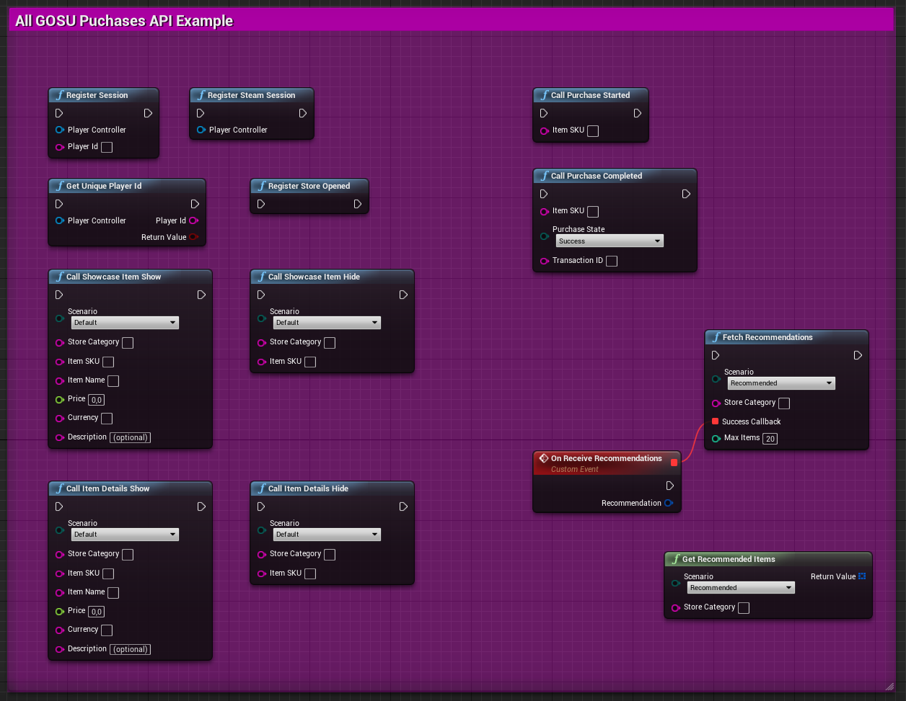
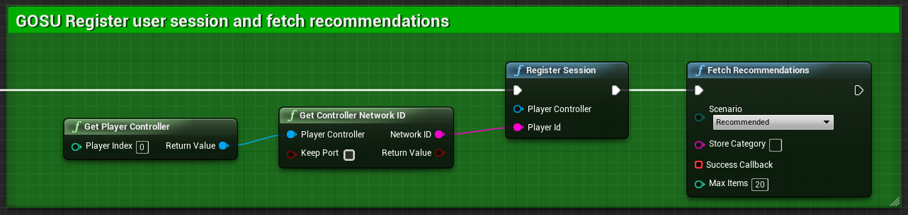
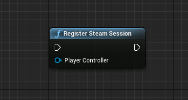
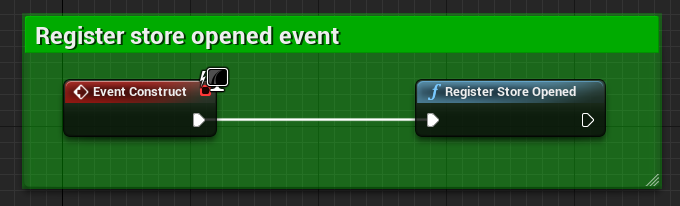
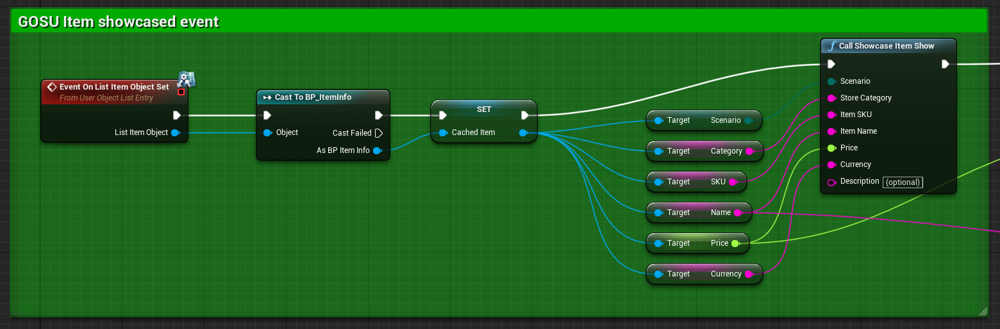
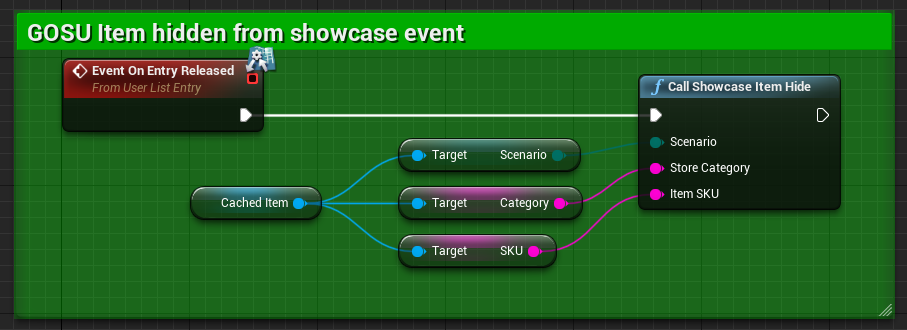
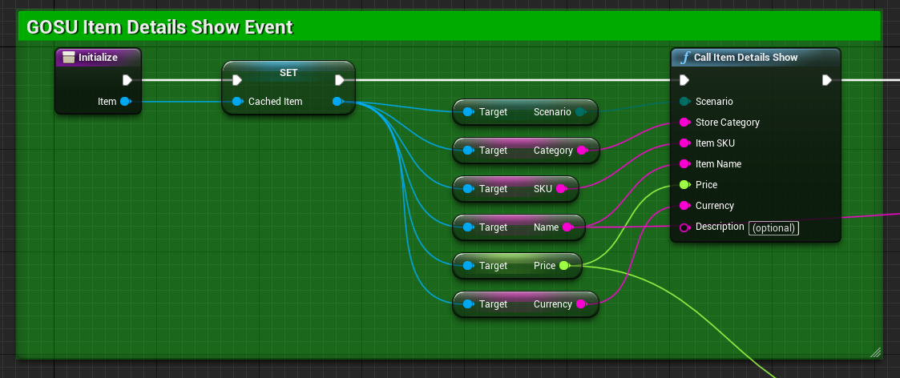
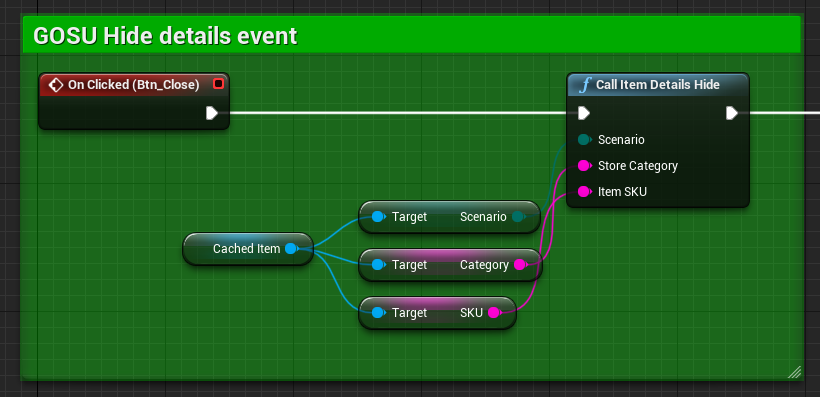
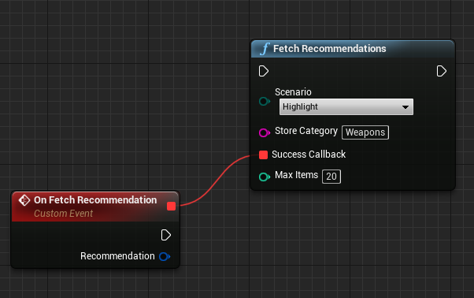
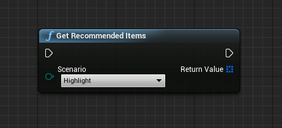

# Contents:
* [intro](#intro)
* [prerequisites](#prerequisites)
* [platforms supported](#platforms-supported)
* [how it works](#how-it-works)
* [most used scenarios](#most-used-scenarios) 
* [how to use](#how-to-use)
* [setting up](#setting-up)

***

## intro:

**GosuAI Purchase Personalisation SDK** enables Unreal Engine developer to personalise player's in-game shopping experience and grow in-game revenue.

[/statusIcon.svg)](https://teamcity.ufna.dev/viewType.html?buildTypeId=GosuAi_ClangFormatCheck&guest=1)

***

## prerequisites:
* Unreal Engine 4.22+
* win 7 (or higher) or macos 10.9.2 (or higher)
* Visual Studio 2017 (or higher) or XCode 10.1 (or higher)
* Make sure to recieve your credentials before using the plugin. You will need `app_id`, `secret_key`, `dev_secret_key`. [Visit website](http://platform.gosu.ai) to receive them.

## platforms supported:
* Steam
* Epic Games Store
* Google Play
* iOS
* PS4
* XBOX
* Switch

## how it works:
SDK connects to players' in-shop behaviour and expects per `player_id` recommendation request. Gosu.ai Personalisation Service now builds, chooses and updates your game recommendation models. SDK fetches a list of in-game shop items sorted by purchase probability for that particular `player_id`. These items are now cached and available for preferred scenario within your in-game shop. As more players are enjoying your game more your recommendations become even better over time. Best part is as soon as new items become available there's no need to do anything special, SDK will pick them up automatically

## most used scenarios:
(may combine) 
* show new **recommended** category with in-game shop items relevant to that specific player (think of it as a new tab)
* visually **highlight** items relevant to that specific player (think of it as a new visual effect)
* show **popup/loading screen** with a specific item out of those relevant to that specific player (think of it as a new in-game shop promotional approach

As items include their corresponding categories it's easy to optionally filter them according to either game logic or business needs.

For example you may want to exclude items from some categories out of recommendations as they only make sense when presented on specific conditions or separate tabs.

Another case might be that you have an objective to drive purchases for specific categories of items and lower others. Creating new tab and filtering recommendations by category is one way to do it.

Pro tip: useful tactic is to setup recommended tab as a default tab (when player enters the shop) and rotate some items within this tab on daily basis.

## how to use:
* install plugin with github or [UE4 marketplace](https://www.unrealengine.com/marketplace/en-US/store) (preferred)
* acquire gosu.ai credentials [here](http://platform.gosu.ai)
* pick 1 of 3 scenarios you would use personalised recommendations for:
  * recommended tab with items
  * highlight recommended item
  * popup with recommended item
* make sure you have design layouts (UMG) being prepared for scenario
* setup plugin:
  * submit credentials at plugin settings (this is critical before going live)
  * make sure you have set up functions
  * receive personalised items
  * enjoy

## setting up

Basic principle is this:
* developer calls for session registration, item show/hide, item details show/hide (if applicable) and purchase initiation/completion
* developer calls to get recommendation. SDK now fetches recommendations from gosu servers and caches them within a client
* they are now available for desired scenario

Events are key actions which are triggered during the store browsing and in-app purchasing process.

Plugin demo already contains an example for the store and processing of events. You can use it as an integration example:

* Load your project and open **Gosu Content** > **Demo** > **W_Demo** to view demo store blueprint. Follow the **green** comment blocks.
* Open level **Gosu Content** > **Maps** > **Demo** to launch the demo.

If you could not find the files mentioned above in Unreal Editor, go for **View Options** and mark the **Show Plugin/Engine Content** checkbox.

## GOSU SDK Nodes

### RegisterSession **(required)**

Register game session with provided player id.

| Name   | Type | Description           |
| :---   | :--- | :---                  |
|PlayerController|APlayerController|Player controller instance|
|PlayerId|string|Unique player ID you're using to authenicate user|

### RegisterSteamSession **(required for Steam only)**

Register game session while using SteamOnlineSubsystem.

| Name   | Type | Description           |
| :---   | :--- | :---                  |
|PlayerController|APlayerController|Player controller instance|

### RegisterStoreOpened **(required)**

Generates unique impression id for futher events.

### CallShowcaseItemShow **(required)**

Item is shown at store page right now.

| Name   | Type | Description           |
| :---   | :--- | :---                  |
|Scenario|string|Scenario alreay applied to show item|
|Category|string|Store category for item|
|ItemSKU|string|Unique item identifier|
|ItemName|string|Item name in store|
|Price|float|Item price|
|Currency|string|Applied currency. Currency code or in-game currency name are expected|
|Description|string|(optional) Human-readable item description|

### CallShowcaseItemHide **(optional)**

Item was hidden at store page.

| Name   | Type | Description           |
| :---   | :--- | :---                  |
|Scenario|string|Scenario alreay applied to show item|
|Category|string|Store category for item|
|ItemSKU|string|Unique item identifier|

### CallItemDetailsShow **(required)**

Item details window was shown.

| Name   | Type | Description           |
| :---   | :--- | :---                  |
|Scenario|enum|Scenario alreay applied to show item|
|Category|string|Store category for item|
|ItemSKU|string|Unique item identifier|
|ItemName|string|Item name in store|
|Price|float|Item price|
|Currency|string|Applied currency. Currency code or in-game currency name are expected|
|Description|string|(optional) Human-readable item description|

### CallItemDetailsHide **(optional)**

Item details window was closed.

| Name   | Type | Description           |
| :---   | :--- | :---                  |
|Scenario|enum|Scenario alreay applied to show item|
|Category|string|Store category for item|
|ItemSKU|string|Unique item identifier|

### CallPurchaseStarted **(required)**

Player triggered purchase process for item.

| Name   | Type | Description           |
| :---   | :--- | :---                  |
|ItemSKU|string|Unique item identifier|

### CallPurchaseCompleted **(required)**

Purchase state was updated.

| Name   | Type | Description           |
| :---   | :--- | :---                  |
|ItemSKU|string|Unique item identifier|
|PurchaseState|enum|Purchase state provided as EInAppPurchaseState enum|
|TransactionID|string|Unique store transaction id|

### FetchRecommendations **(required)**

Fetch recommended items from GOSU server for desired scenario and store category. These items are now cached within a current game session. Asyn functions that should be started after session registration event.

| Name   | Type | Description           |
| :---   | :--- | :---                  |
|Scenario|enum|Desired scenario|
|StoreCategory|string|(optional) Desired category for Highlight scenario|
|MaxItems|int32|Limit recommendation size with provided number of items|

### GetRecommendedItems

Get cached recommended items for desired category (call ReceiveRecommendations to have fresh data).

| Name   | Type | Description           |
| :---   | :--- | :---                  |
|Scenario|enum|Desired scenario|
